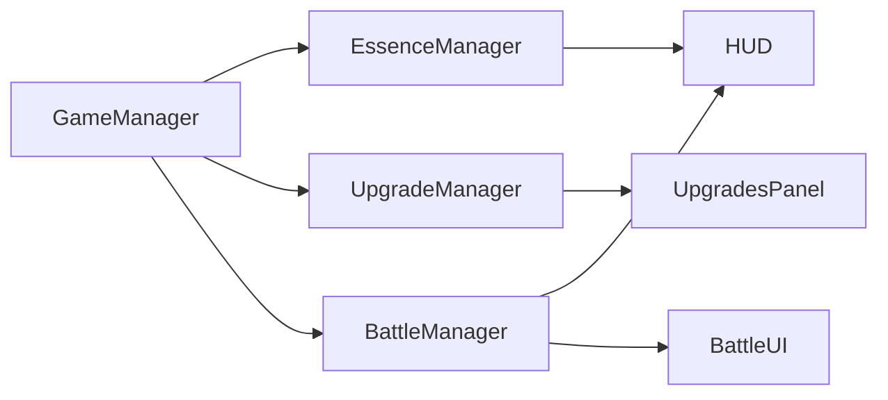

\# Slice of Life — CODEX (Vertical-Slice MVP)

\_Last updated: 2025-08-09 • Engine: Unity 6.2 URP • Target: PC (1080p)\_

This file is the source of truth for design + tech. Keep it short and link out to auto-generated snapshots:

\- Project snapshots: `docs/CONTEXT.md`, `docs/assets-files.txt`, `docs/assets-dirs.txt`

  (Update via \*\*Unity Menu → Tools → Generate Project Snapshot\*\*)

---

\## 1) One-Sentence Pitch

“Slice of Life” is a darkly comedic, adult-themed harem-isekai incremental/RPG where you collect essence to grow a basement camp into a tavern-guild, recruit sexy waifus, and battle in card-based, turn-based combat—interspersed with 3D exploration and bite-sized station mini-games.

\## 2) High-Level Overview

\- \*\*Genre \& Tone\*\*: Incremental/RPG hybrid; turn-based, card-driven combat; station mini-games; dark humor; suggestive adult flavor (no explicit porn).

\- \*\*Framing\*\*: Reincarnated adventurer rebuilds an abandoned tavern’s \*\*basement camp\*\* into a kingdom, crafting a harem dynasty across generations.

\## 3) Target Audience

\- \*\*18–45 (primarily male)\*\*; fans of isekai/harem anime, dark comedy, “edgy” niche games.

\- \*\*Platforms\*\*: PC (Itch → EA → Steam).

\- \*\*Community\*\*: YouTube + Patreon.

\## 4) Player Motivations \& Hooks

1\) \*\*Essence Collection\*\*: cheeky panty-themed currency powers upgrades.

2\) \*\*Harem Building\*\*: recruit/level sexy waifus—generic cards for combat + \*\*4 Story Harem\*\* station managers.

3\) \*\*Tactical Battles\*\*: card-driven, turn-based fights (Demeo vibes).

4\) \*\*Stations \& Automation\*\*: Farm, Kitchen, Alchemy, Blacksmith = micro-games and idle sinks.

5\) \*\*Generational Prestige\*\*: heirs carry legacy buffs into tougher biomes.

\## 5) Core Gameplay Loops

\### 5.1 Daily / Session (≈ 10–15 min)

1\. \*\*Manual essence\*\* clicks (≤10/day, scales via altar upgrades).

2\. Spend essence on upgrades (incl. \*\*unlock Dungeon\*\*).

3\. \*\*Dungeon run\*\* (3D static scene): short sequence of fights → boss; harvest resources.

   - Combat: turn-based cards via \*\*waifu cards\*\* (Attack/Guard/Mend/Skill).

4\. \*\*Stations\*\* (once unlocked): quick micro-games; later automate via managers.

5\. \*\*Sleep\*\*: resets click cap, advances day; passives/autos tick.

\### 5.2 Station Unlocks (in-run)

\- Floor 10: \*\*Tavern above basement\*\* + \*\*Farm\*\* (secondary currency: Gold).

\- Floor 20: \*\*Kitchen\*\* • Floor 40: \*\*Alchemy\*\* • Floor 60: \*\*Blacksmith\*\*.

\- Assign 1 of 4 \*\*Story Harem\*\* managers; their levels boost auto-gen and can bypass manual mini-games post-intro.

\### 5.3 Generational Prestige (Legacy)

\- \*\*Trigger\*\*: player chooses to “Fertilize” after major milestone.

\- \*\*Effect\*\*: reset in-run progress; \*\*carry permanent bonuses\*\* (e.g., +10% essence, deeper start).

\- \*\*Progression\*\*: unlock new biomes (Forest → Desert → Arctic), new waifu classes, deeper floors.

\## 6) Systems Overview (MVP status)

| System | Status | Responsibilities |

|---|---|---|

| \*\*GameManager\*\* | Full | Tracks essence/day/clicks; refs to Essence/Upgrades; broadcasts events. |

| \*\*Essence \& Currency\*\* | Full | Manual clicks (≤10/day), dungeon rewards, passive/sec; spend/add APIs. |

| \*\*Upgrade System\*\* | Partial | SO-driven upgrades (unlock Dungeon, altar buffs, reward multiplier). |

| \*\*Dungeon / Combat\*\* | Partial | Single floor; 3D stub arena; turn-based card combat; rewards → essence. |

| \*\*Exploration/Harvesting\*\* | Stub | Single room interactables (Altar, Bed, Door). |

| \*\*Stations (Farm/Kitchen/Alchemy/Blacksmith)\*\* | Data Stubs | Interfaces + SOs + manager to track stations/companions. |

| \*\*Waifu Collection\*\* | Partial Stub | Placeholder waifu cards; first passive buff hook. |

| \*\*Generational Legacy\*\* | UI Stub | “Fertilize” button + future reset/bonus flow. |

| \*\*Save/Load\*\* | Full | JSON/PlayerPrefs; re-applies one-shot upgrades on load. |

\## 7) Technical Architecture

\- \*\*Pattern\*\*: MVC-ish. \*\*Model\*\* = ScriptableObjects \& C# state; \*\*View\*\* = TMP UI; \*\*Controller\*\* = buttons, Battle logic; \*\*GameManager\*\* orchestrates.

\- \*\*Singleton\*\*: `GameManager` (DontDestroyOnLoad).

\- \*\*Stations\*\*: `StationManager` maintains `IStation`/`ICompanion` lists, exposed via `GameManager`.

\- \*\*Events\*\*: `OnEssenceChanged`, `OnClicksLeftChanged`, `OnPurchased`, `OnBattleEnded`, `OnPlayerStatsChanged`, `OnEnemyStatsChanged`.

\- \*\*Scenes\*\*: `Start`, `Battle`.

\- \*\*Prefabs\*\*: `BattleRoot` (BattleManager + UI), `CardView`, `UpgradeButtonPrefab`.

### Architecture Diagram

### Glossary

| Term | Definition |
|---|---|
| **GameManager** | Singleton orchestrator that mediates cross-system communication. |
| **Essence** | Primary currency earned from clicks or battles, spent on upgrades. |
| **Dungeon Key** | Daily token consumed to attempt a dungeon run. |
| **Upgrade** | ScriptableObject-driven improvement purchased with essence. |
| **BattleManager** | Turn-based controller handling player/enemy actions and rewards. |

\## 8) Art \& Audio Direction

\- \*\*MVP\*\*: grey-box tavern basement \& dungeon; simple essence icon; placeholder waifu portraits/cards.

\- \*\*Future\*\*: AI-generated waifu art; stylized stations (NV3D packs); SFX for clicks/combat/mini-games.

\## 9) MVP Scope \& Roadmap

| Phase | Focus | Deliverable |

|---|---|---|

| 1 | Core setup \& manual essence | URP project + GameManager + HUD + click logic (≤10/day) + persistence |

| 2 | Upgrades \& dungeon unlock | Upgrade SOs + affordability UI + doorUnlocked gate |

| 3 | Dungeon + combat prototype | Single-floor 3D scene + turn-based card stub + essence reward |

| 4 | Day/cycle \& passive buff | Sleep resets + dayIndex; first waifu passive/sec |

| 5 | Waifu recruit stub \& HUD | Placeholder card spawn + passive rate display |

| 6 | Station \& legacy stubs | Buttons for Farm/Kitchen/Alchemy/Blacksmith + “Fertilize” UI |

| 7 | Vertical slice tie-in | Click → upgrade → dungeon → sleep → recruit → passive flow |

| 8 | Polish | Persistence audit, event reliability, UX tweaks |

\### Milestones (targets)

\- Day 2: manual clicks ≤10/day update HUD \& persist.

\- Day 4: buy upgrade → unlock dungeon door → enter battle scene.

\- Day 6: finish one dungeon floor → grant essence → return to Hub.

\- Day 8: sleep resets clicks; recruit stub; passive/sec displays.

\## 10) Long-Term Vision

\- \*\*Stations\*\*: Trees, automation, farm→kitchen→alchemy→blacksmith resource chains.

\- \*\*Deck-building\*\*: card drops, upgrades, party formation, rarities/tags.

\- \*\*Biomes \& Trade\*\*: chapters with unique managers; cross-kingdom routes.

\- \*\*Generational\*\*: heir selection, legacy system, narrative chapters.

\- \*\*Polish\*\*: particles, popups, audio, AI-assisted art pipeline.

---

\# IMPLEMENTATION (what exists today)

\## A. Public APIs (stable entry points)

\*\*EssenceManager\*\*

\- `bool TryClickHarvest()` • `bool TrySpend(int amount)` • `void AddExternal(int amount)`

\- Events: `OnEssenceChanged(int)`, `OnClicksLeftChanged(int)`

\*\*UpgradeManager : IUpgradeProvider\*\*

\- `bool TryPurchase(UpgradeSO)` • `bool IsPurchased(string id)`

\- `IReadOnlyCollection<string> PurchasedIds` • `IReadOnlyList<UpgradeSO> Available`

\- `float RewardMultiplier` (×1.0 base; multiplicative stack)

\- `event Action<UpgradeSO> OnPurchased`

\- `LoadPurchased(IEnumerable<string> ids)` → reapply one-shots → `RecalculateDerivedStats()`

\*\*BattleManager\*\*

\- `void PlayAction(BattleAction)` • `void PlayCard(CardSO)`

\- Events: `OnInfoChanged(string)`, `OnPlayerStatsChanged(int hp, int armor)`, `OnEnemyStatsChanged(int hp)`, `OnBattleEnded(bool win, int reward)`

\- Victory: reward = `RoundToInt(config.baseEssenceReward \\\\\\\* Upgrades.RewardMultiplier)`

> \\\\\\\*\\\\\\\*Rule\\\\\\\*\\\\\\\*: world-space interactions (3D Altar/Bed/Door) must call these APIs—no bypassing.

\## B. Data Contracts (SO)

\- \*\*BattleConfigSO\*\*: `playerMaxHP, enemyMaxHP, playerAttack, enemyLight/Heavy, enemyLeech, baseEssenceReward, returnDelay`

\- \*\*UpgradeSO\*\*: `id, title, cost, effect (IncreaseClick | IncreasePassive | UnlockBattle | BattleRewardBonus), value`

\- \*\*CardSO\*\*: `id, title, description, action (Attack | Guard | Mend), cost (reserved for energy later)`

\## C. Scene \& Prefab Wiring (required)

\*\*Start\*\*: Systems (GameManager, EssenceManager, UpgradeManager), `HUD` (Gather/Sleep), `UpgradesPanel`, `DungeonGateButton` (needs `unlock\\\\\\\_battle`), `LoadSceneButton("Battle")`

\*\*BattleRoot prefab\*\*: BattleManager + EnemyAI w/ `BattleConfig`; `BattleUI` with Player/Enemy/Info + HP bars; `HandPanel + CardHandUI` (spawns `CardView` from `CardSO`s)

\## D. Tuning (defaults)

\- Click cap \*\*10\*\* • Per click \*\*1\*\* • Passive/sec \*\*0\*\*

\- Base dungeon reward \*\*20\*\* • RewardMultiplier \*\*1.0\*\* (e.g., `+25%` → ×1.25)

---

\# WORKING AGREEMENTS

1\) After each milestone: run \*\*Tools → Generate Project Snapshot\*\*; update \*\*APIs\*\* above if changed; commit.

2\) Keep `Assets/TextMesh Pro/Resources/\\\\\\\*\\\\\\\*`; delete/ignore TMP \*\*Examples \& Extras\*\*.

3\) Third-party packs live under `Assets/ThirdParty/PackName/` (ignored if solo; use LFS if shared).

---

\# LINKS

\- Snapshots: `docs/CONTEXT.md`, `docs/assets-files.txt`, `docs/assets-dirs.txt`

\- (Optional) Vision docs: `docs/vision/HighLevel.md`, `docs/vision/3DWrapper.md`, `docs/vision/Companions.md`, `docs/vision/Systems.md`

