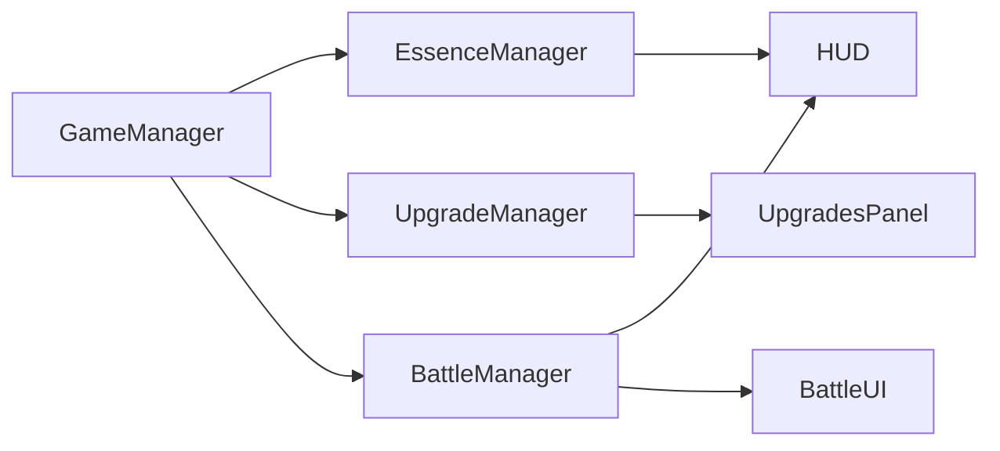

\# Slice of Life — CODEX (Vertical-Slice MVP)

\_Last updated: 2025-08-12 • Engine: Unity 6.2 URP • Target: PC (1080p)\_

This file is the source of truth for design + tech. Keep it short and link out to auto-generated snapshots:

\- Project snapshots: `docs/CONTEXT.md`, `docs/assets-files.txt`, `docs/assets-dirs.txt`

  (Update via \*\*Unity Menu → Tools → Generate Project Snapshot\*\*)

---

\## 1) One-Sentence Pitch

“Slice of Life” is a darkly comedic, adult-themed harem-isekai incremental/RPG where you collect essence to grow a basement camp into a tavern-guild, recruit sexy waifus, and battle in card-based, turn-based combat—interspersed with 3D exploration and bite-sized station mini-games.

\## 2) High-Level Overview

\- \*\*Genre \& Tone\*\*: Incremental/RPG hybrid; turn-based, card-driven combat; station mini-games; dark humor; suggestive adult flavor (no explicit porn).

\- \*\*Framing\*\*: Reincarnated adventurer rebuilds an abandoned tavern’s \*\*basement camp\*\* into a kingdom, crafting a harem dynasty across generations.

\## 3) Target Audience

\- \*\*18–45 (primarily male)\*\*; fans of isekai/harem anime, dark comedy, “edgy” niche games.

\- \*\*Platforms\*\*: PC (Itch → EA → Steam).

\- \*\*Community\*\*: YouTube + Patreon.

\## 4) Player Motivations \& Hooks

1\) \*\*Essence Collection\*\*: cheeky panty-themed currency powers upgrades.

2\) \*\*Harem Building\*\*: recruit/level sexy waifus—generic cards for combat + \*\*4 Story Harem\*\* station managers.

3\) \*\*Tactical Battles\*\*: card-driven, turn-based fights (Demeo vibes).

4\) \*\*Stations \& Automation\*\*: Farm, Kitchen, Alchemy, Blacksmith = micro-games and idle sinks.

5\) \*\*Generational Prestige\*\*: heirs carry legacy buffs into tougher biomes.

\## 5) Core Gameplay Loops

\### 5.1 Daily / Session (≈ 10–15 min)

1\. \*\*Manual essence\*\* clicks (≤10/day, scales via altar upgrades).

2\. Spend essence on upgrades (incl. \*\*unlock Dungeon\*\*).

3\. \*\*Dungeon run\*\* (3D static scene): short sequence of fights → boss; harvest resources.

   - Combat: turn-based cards via \*\*waifu cards\*\* (Attack/Guard/Mend/Skill).

4\. \*\*Stations\*\* (once unlocked): quick micro-games; later automate via managers.

5\. \*\*Sleep\*\*: resets click cap, advances day; passives/autos tick.

\### 5.2 Station Unlocks (in-run)

\- Floor 10: \*\*Tavern above basement\*\* + \*\*Farm\*\* (secondary currency: Gold).

\- Floor 20: \*\*Kitchen\*\* • Floor 40: \*\*Alchemy\*\* • Floor 60: \*\*Blacksmith\*\*.

\- Assign 1 of 4 \*\*Story Harem\*\* managers; their levels boost auto-gen and can bypass manual mini-games post-intro.

\### 5.3 Generational Prestige (Legacy)

\- \*\*Trigger\*\*: player chooses to “Fertilize” after major milestone.

\- \*\*Effect\*\*: reset in-run progress; \*\*carry permanent bonuses\*\* (e.g., +10% essence, deeper start).

\- \*\*Progression\*\*: unlock new biomes (Forest → Desert → Arctic), new waifu classes, deeper floors.

\## 6) Systems Overview (MVP status)

| System | Status | Responsibilities |

|---|---|---|

| \*\*GameManager\*\* | Full | Tracks essence/day/clicks; serialized refs to Essence/Upgrades/Stations; broadcasts events. |

| \*\*Essence \& Currency\*\* | Full | Manual clicks (≤10/day), dungeon rewards, passive/sec; spend/add APIs. |

| \*\*Upgrade System\*\* | Partial | SO-driven upgrades (unlock Dungeon, altar buffs, reward multiplier). |

| \*\*Dungeon / Combat\*\* | Partial | Single floor; 3D stub arena; turn-based card combat; rewards → essence. |

| \*\*Exploration/Harvesting\*\* | Stub | Single room interactables (Altar, Bed, Door). |

| \*\*Stations (Farm/Kitchen/Alchemy/Blacksmith)\*\* | Data Stubs | Interfaces + SOs + manager to track stations/companions. |

| \*\*Waifu Collection\*\* | Partial Stub | Placeholder waifu cards; first passive buff hook. |

| \*\*Inventory\*\* | Partial | Item stacks, slot limits, add/remove APIs, persists via SaveModelV2; emits OnInventoryChanged. |

| \*\*Resources\*\* | Stub | `ResourceManager` tracks material counts; `AddResource`/`TryConsumeResource` fire `OnResourceChanged`. |

| \*\*Generational Legacy\*\* | UI Stub | “Fertilize” button + future reset/bonus flow. |

| \*\*Save/Load\*\* | Full | `SaveModelV2` writes state directly to managers; `SaveScheduler` batches requests before JSON/PlayerPrefs write. |

\## 7) Technical Architecture

\- \*\*Pattern\*\*: MVC-ish. \*\*Model\*\* = ScriptableObjects \& C# state; \*\*View\*\* = TMP UI; \*\*Controller\*\* = buttons, Battle logic; \*\*GameManager\*\* orchestrates.

\- \*\*Singleton\*\*: `GameManager` (DontDestroyOnLoad).
\- \*\*Core wiring\*\*: `GameManager` expects `EssenceManager`, `UpgradeManager`, `StationManager`, `InventoryManager`, and `ResourceManager` references assigned in the scene/prefab; it no longer searches at runtime.

\- \*\*Stations\*\*: `StationManager` maintains `IStation`/`ICompanion` lists and now builds
  ID-to-asset dictionaries on `Awake` for O(1) lookups. External systems can fetch
  assets via `GetStationById(id)` / `GetCompanionById(id)` or inspect the read-only
  `StationLookup` / `CompanionLookup` dictionaries. `UnlockStation(id)` and
  `RecruitCompanion(id)` update internal collections and immediately raise
  `GameManager.Events.StationUnlocked` / `GameManager.Events.CompanionRecruited`.
  `RecruitCompanion` also invokes `OnCompanionRecruited(ICompanion, IReadOnlyList<CardSO>, IReadOnlyList<UpgradeSO>)`
  so battle and upgrade systems can claim a companion's starting deck and buffs.
  Each `CompanionSO` serializes these via `GetStartingCards()`, `GetStartingDeck()`,
  `GetEquipmentSlots()` and `GetPassiveBuffs()` accessors.
  The manager subscribes to `IStation.OnProductionComplete` and forwards results through
  `GameManager.Events.MinigameCompleted`.

\- \*\*Event bus\*\*: `IEventBus` interface (default `DefaultEventBus` component) exposes cross-system events:
  - `DayChanged(int day)`
  - `DungeonKeysChanged(int current, int perDay)`
  - `SleepEligibilityChanged(bool canSleep, string reason)`
  - `StationUnlocked(IStation station)`
  - `CompanionRecruited(ICompanion companion)`
  - `SkillUnlocked(SkillSO skill)`
  - `ResourceChanged(ResourceSO resource, int amount)`
  - `RecipeUnlocked(RecipeSO recipe)`
  - `FloorReached(int floor)`
  - `UpgradePurchased(UpgradeSO upgrade)`
  - `MinigameCompleted(MinigameResult result)`
  Subscribe in `OnEnable` and unsubscribe in `OnDisable`.
  - **New**: Added `RecipeUnlocked` and `FloorReached` so UI can react when crafting expands or the dungeon deepens.
  - **Test**: Call `Recipes.UnlockRecipe("someId")` or `Dungeon.AdvanceFloor()` in play mode and watch subscribed panels respond.
\- \*\*Other events\*\*: `OnEssenceChanged`, `OnClicksLeftChanged`, `OnPurchased`, `OnInventoryChanged`, `OnBattleEnded`, `OnPlayerStatsChanged`, `OnEnemyStatsChanged` remain on their respective systems.

- **GameEvents**: lightweight static hub mirroring common manager events for quick prototypes. Currently forwards `OnEssenceChanged`, `OnInventoryChanged`, `OnTaskAdvanced`, `OnTaskCompleted`, `OnUpgradePurchased`, `OnDayChanged`, `OnDungeonKeysChanged`, and `OnSleepEligibilityChanged`.

- **Tasks**: `TaskService.CurrentTaskTitle` exposes the active tutorial step's title. Useful for HUDs that want to display guidance.
  - *New*: Task requirements are modular `TaskConditionSO` assets (e.g., `CollectItemCondition`, `InteractCondition`). Each overrides `IsMet(TaskService)`.
  - **Test**: Create a `CollectItemCondition` asset, assign it to a `TaskSO`, then collect the referenced item in play mode and observe the task advance.

   - **Tasks Access**: `GameManager.Tasks` exposes the `TaskService` so systems can query or save tutorial progress.
   
   - **Debuff Access**: `GameManager.TempNextDayClickDebuff` reveals the click-cap reduction that will apply on the next day.
   - **Scene Tracking**: `GameManager.CurrentScene` and `GameManager.SpawnPointId` record the last scene and spawn point for persistence.
  - **Persistence**: `SaveSystem` v2 writes a single `SaveModelV2` JSON file instead of sectioned blobs. `GameManager` no longer tracks a registry of `ISaveable` systems; the model pulls state directly from each manager's capture/apply methods. The model now includes `lastScene` and `spawnPointId` fields so the world can restore to the previous location. `SaveSystem` offers `HasAnySave()`, `Delete()`, `Save(GameManager, TaskService)`, and `Load(GameManager, TaskService)` APIs (task service parameter is optional if `GameManager` already has one injected). **Test**: move to another scene in play mode, call `SaveSystem.Save`, restart, then `Load` and confirm `GameManager.CurrentScene` and `SpawnPointId` match the prior session.
\- **Test**: Call `Stations.UnlockStation("farm")` or `Stations.RecruitCompanion("alice")` in play mode and watch the console/UI react via the event bus (`StationUnlocked` or `CompanionRecruited`).
  Trigger a station's `OnProductionComplete` to see `MinigameCompleted` propagate.

\- \*\*Scenes\*\*: `Start`, `Battle`.

\- \*\*Prefabs\*\*: `BattleRoot` (BattleManager + UI), `CardView`, `UpgradeButtonPrefab`.

### Architecture Diagram

### Glossary

| Term | Definition |
|---|---|
| **GameManager** | Singleton orchestrator that mediates cross-system communication. Exposed via `IGameManager` so callers can depend on an interface. |
| **IGameManager** | Interface describing the GameManager's public API for injection. |
| **Essence** | Primary currency earned from clicks or battles, spent on upgrades. |
| **Dungeon Key** | Daily token consumed to attempt a dungeon run. |
| **Upgrade** | ScriptableObject-driven improvement purchased with essence. |
| **BattleManager** | Orchestrates turn flow by composing DeckManager, EnergyPool, StatusController and BattleRewardService. |
| **DeckManager** | Stores the battle deck and equipment, offers add/remove helpers, and handles shuffle, draw, discard, and starting hand generation. |
| **EnergyPool** | Tracks current/max energy and spending. Raises `OnEnergyChanged`. |
| **StatusController** | Maintains Weak/Vulnerable timers and exposes formatted labels. |
| **BattleRewardService** | Calculates victory rewards and grants essence. |

### Recent Changes
- Added `IGameManager` interface. `GameManager` now implements it and callers receive `IGameManager` references instead of using the static singleton.
- Introduced `IEventBus` with `DefaultEventBus` implementation. GameManager, HUD, and BattleManager now receive an event bus reference instead of calling static `GameEvents`.
- To test: assign a `DefaultEventBus` component to `eventBusSource` fields on GameManager, HUD, and BattleManager. Run the game, unlock a station or recruit a companion, and ensure HUD and other listeners react via bus events.
- Added `MinigameResult`, updated `IMinigame` to `PlayAsync`, and introduced `MinigameLauncher` + new `MinigameCompleted` event.
- To test: create a scriptable object implementing `IMinigame`, then call `MinigameLauncher.LaunchAsync` and watch listeners receive the result via the event bus.
- Added `DungeonProgression` system. Tracks `CurrentFloor` and `MaxFloorReached`, unlocking stations at floor milestones (10, 20, 30...). `GameManager` exposes it via the new `Dungeon` property. **Test**: in play mode call `GameManager.Instance.Dungeon.AdvanceFloor()` enough times to cross a milestone and confirm the station unlocks and progress persists after saving/loading.
- Added `LocationSO` data and `MapUI` that spawns buttons for unlocked locations. Event bus now exposes `UpgradePurchased` for UI refreshes.
- To test: create LocationSO assets for Hub and Battle, assign them to MapUI, purchase the battle unlock upgrade, and verify the Battle button appears and loads the scene.
- Split `HUD` into a lightweight container with pluggable `HUDPanel` components. Panels subscribe only to needed `IEventBus` events and register themselves for easy prefab addition.
- To test: in a scene with HUD, add `CurrencyHUDPanel`, `KeysHUDPanel`, and `SleepHUDPanel` components to appropriate UI objects. Wire button OnClick events to the panels and ensure essence, keys, and sleep states update when playing.

\## 8) Art \& Audio Direction

\- \*\*MVP\*\*: grey-box tavern basement \& dungeon; simple essence icon; placeholder waifu portraits/cards.

\- \*\*Future\*\*: AI-generated waifu art; stylized stations (NV3D packs); SFX for clicks/combat/mini-games.

\## 9) MVP Scope \& Roadmap

| Phase | Focus | Deliverable |

|---|---|---|

| 1 | Core setup \& manual essence | URP project + GameManager + HUD + click logic (≤10/day) + persistence |

| 2 | Upgrades \& dungeon unlock | Upgrade SOs + affordability UI + doorUnlocked gate |

| 3 | Dungeon + combat prototype | Single-floor 3D scene + turn-based card stub + essence reward |

| 4 | Day/cycle \& passive buff | Sleep resets + dayIndex; first waifu passive/sec |

| 5 | Waifu recruit stub \& HUD | Placeholder card spawn + passive rate display |

| 6 | Station \& legacy stubs | Buttons for Farm/Kitchen/Alchemy/Blacksmith + “Fertilize” UI |

| 7 | Vertical slice tie-in | Click → upgrade → dungeon → sleep → recruit → passive flow |

| 8 | Polish | Persistence audit, event reliability, UX tweaks |

\### Milestones (targets)

\- Day 2: manual clicks ≤10/day update HUD \& persist.

\- Day 4: buy upgrade → unlock dungeon door → enter battle scene.

\- Day 6: finish one dungeon floor → grant essence → return to Hub.

\- Day 8: sleep resets clicks; recruit stub; passive/sec displays.

\## 10) Long-Term Vision

\- \*\*Stations\*\*: Trees, automation, farm→kitchen→alchemy→blacksmith resource chains.

\- \*\*Deck-building\*\*: card drops, upgrades, party formation, rarities/tags.

\- \*\*Biomes \& Trade\*\*: chapters with unique managers; cross-kingdom routes.

\- \*\*Generational\*\*: heir selection, legacy system, narrative chapters.

\- \*\*Polish\*\*: particles, popups, audio, AI-assisted art pipeline.

---

\# IMPLEMENTATION (what exists today)

\## A. Public APIs (stable entry points)

\*\*EssenceManager\*\*

\- `bool TryClickHarvest()` • `bool TrySpend(int amount)` • `void AddExternal(int amount)`

\- Events: `OnEssenceChanged(int)`, `OnClicksLeftChanged(int)`

\*\*UpgradeManager : IUpgradeProvider\*\*

\- `bool TryPurchase(UpgradeSO)` • `bool IsPurchased(string id)`

\- `IReadOnlyCollection<string> PurchasedIds` • `IReadOnlyList<UpgradeSO> Available`

\- `float RewardMultiplier` (×1.0 base; multiplicative stack)

\- `event Action<UpgradeSO> OnPurchased`

\- `LoadPurchased(IEnumerable<string> ids)` → reapply one-shots → `RecalculateDerivedStats()`

**BattleManager**

- `void PlayCard(CardSO)`

- Events: `OnInfoChanged(string)`, `OnPlayerStatsChanged(int hp, int maxHp, int armor)`, `OnEnemyStatsChanged(int hp, int maxHp)`, `OnEnergyChanged(int current, int max)`, `OnHandChanged(IEnumerable<CardSO>)`, `OnPlayerStatusChanged(string)`, `OnEnemyStatusChanged(string)`, `OnBattleEnded(bool win, int reward)`

- Victory rewards delegated to `BattleRewardService`

**SceneLoader**

- `Task LoadSceneAsync(string sceneName)` • uses `_fader` `CanvasGroup` to fade out/in over `_fadeDuration` seconds (skips if unset)

> \\\\\\\*\\\\\\\*Rule\\\\\\\*\\\\\\\*: world-space interactions (3D Altar/Bed/Door) must call these APIs—no bypassing.

\## B. Data Contracts (SO)

\- **BattleConfigSO**: `playerMaxHP, enemy (EnemySO), baseEssenceReward, returnDelay`
\- **EnemySO**: `maxHP, lightDamage, heavyDamage, leechHeal, light/Heavy/Leech weights, ai`

\- **UpgradeSO**: `id, title, cost, effect (IUpgradeEffect asset)`

\- \*\*CardSO\*\*: `id, title, description, effect (CardEffect), cost (reserved for energy later)`

\## C. Scene \& Prefab Wiring (required)

**Start**: Systems (GameManager, EssenceManager, UpgradeManager, SceneLoader), `HUD` (Gather/Sleep), `UpgradesPanel`, `DungeonGateButton` (needs `unlock_battle`, loads "Battle")

**BattleRoot prefab**: BattleManager w/ `BattleConfig` (selects `EnemySO` + AI); `BattleUI` with Player/Enemy/Info + HP bars; `HandPanel + CardHandUI` (`PopulateHand(IEnumerable<CardSO>)` + `RefreshAffordability(int)` spawns `CardView` from `CardSO`s)

\## D. Tuning (defaults)

\- Click cap \*\*10\*\* • Per click \*\*1\*\* • Passive/sec \*\*0\*\*

\- Base dungeon reward \*\*20\*\* • RewardMultiplier \*\*1.0\*\* (e.g., `+25%` → ×1.25)

---

\# WORKING AGREEMENTS

1\) After each milestone: run \*\*Tools → Generate Project Snapshot\*\*; update \*\*APIs\*\* above if changed; commit.

2\) Keep `Assets/TextMesh Pro/Resources/\\\\\\\*\\\\\\\*`; delete/ignore TMP \*\*Examples \& Extras\*\*.

3\) Third-party packs live under `Assets/ThirdParty/PackName/` (ignored if solo; use LFS if shared).

\## Recent Changes
- 2025-08-13: Migrated cards to polymorphic `CardEffect` assets. Removed per-card numbers from `BattleConfigSO`.
  - How to test: open a card asset, ensure its **Effect** field references a `CardEffect`, then run a battle and play the card to see its configured behavior.
- 2025-08-13: Removed `GameManager` saveables registry; `SaveModelV2` now captures state directly from managers.
  - How to test: run the game, call `SaveSystem.Save` then `SaveSystem.Load`, and confirm progress persists without registering systems.
- 2025-08-10: Added `SceneLoader` service and migrated `LoadSceneButton`/`DungeonGateButton` to use it.
  - How to test: assign `SceneLoader` in Start scene and click the gate to load `Battle`.
- 2025-08-10: Added `UpgradeIds` static class to centralize upgrade ID strings.
  - How to test: project compiles; dungeon gate button and HUD use `UpgradeIds.UnlockBattle`.
- 2025-08-10: Introduced `ItemCardSO` (replacing `ItemSO`), `InventoryManager`, and inventory persistence. `MinigameResult` can now carry item rewards which `MinigameLauncher` deposits automatically.
  - How to test: create an `ItemCardSO`, assign it in a test mini-game returning `(true, 0, item, qty)`, run the mini-game and confirm the item appears in `InventoryManager` and remains after save/load.
- 2025-08-10: Added basic skill tree framework (`SkillSO`, `SkillTreeManager`) and `SkillUnlocked` event on `IEventBus`.
  - How to test: create a couple `SkillSO` assets, assign them to a `SkillTreeManager` hooked into `GameManager`. Call `Unlock` on a skill and verify the event fires and the skill ID persists in the save file.
- 2025-08-10: Added `RecipeSO` and `RecipeManager` with persistence; `GameManager` now exposes `Recipes`, and `BattleConfigSO` can grant recipe unlocks.
  - How to test: create a `RecipeSO`, assign it to `GameManager`'s `recipeManager` and to `BattleConfigSO.recipeReward`, win a battle, then save and reload to confirm the recipe remains unlocked.

- 2025-08-10: Registered `ResourceManager`, `RecipeManager`, and `DungeonProgression` as saveable systems and bumped save file version to 6.
  - How to test: give yourself some resources, unlock a recipe, advance a dungeon floor, save, then reload to verify resources, recipes, and max floor persist.

- 2025-08-11: Introduced `ItemSO` and `IInventoryService`; `InventoryManager` now operates on `ItemSO`. Added temporary `InventoryDebugMenu` and starter item assets.
  - How to test: place `InventoryDebugMenu` in a scene, assign an `InventoryManager` and an item asset, then press Add/Remove and observe console logs for "Inventory changed".
- 2025-08-11: Added basic world interaction system (`IInteractable`, `Interactable`, `InteractionController`) plus item grant/consume components.
  - How to test: in a scene, place a camera with `InteractionController`, add a cube with `Interactable` and `ItemGrantOnInteract`, assign a test `ItemSO`, run and click the cube to see the prompt and item grant in console logs.
- 2025-08-12: Introduced `InteractionPromptUI` and updated `InteractionController` to drive it instead of `Debug.Log`.
  - How to test: place a `Canvas` with a `TMP_Text` and `InteractionPromptUI`, assign it to `InteractionController`'s **Prompt UI** field, then look at and click interactables to watch the label update.
- 2025-08-12: Added screen fade transitions to `SceneLoader` via `CanvasGroup` fader.
  - How to test: in a scene with `SceneLoader`, assign a full-screen `CanvasGroup` to its **Fader** field, set a duration, then trigger a scene change and observe fade to black and back.

## Commenting Style

- Every script under `Assets/Scripts/**` begins with a block comment summarizing its role, dependencies, and expansion hooks.
- Use XML `///` summaries on classes, serialized fields, and public methods to clarify purpose, Unity lifecycle timing, and integration points.
- Annotate event subscriptions (`OnEnable`/`OnDisable`), complex conditionals, and data transformations with inline comments.
- Flag extension points with notes like `// Expansion:` so future features know where to plug in.

---

\# LINKS

\- Snapshots: `docs/CONTEXT.md`, `docs/assets-files.txt`, `docs/assets-dirs.txt`

\- (Optional) Vision docs: `docs/vision/HighLevel.md`, `docs/vision/3DWrapper.md`, `docs/vision/Companions.md`, `docs/vision/Systems.md`

